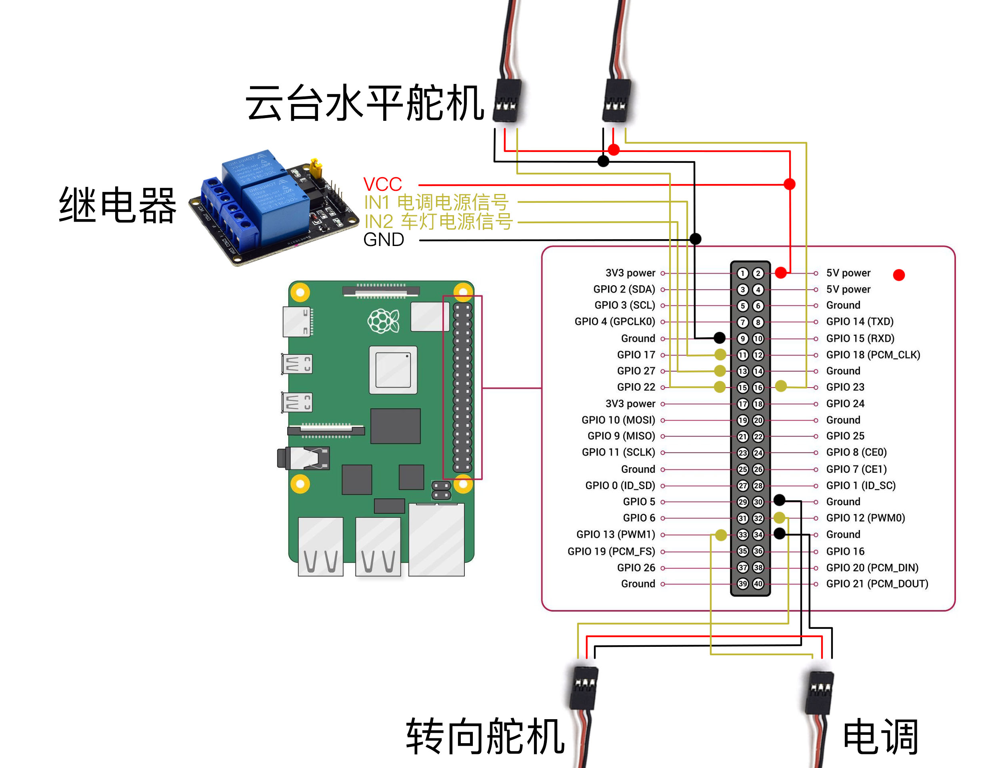

# Network RC -  Remote Control Car Software For Raspberry Pi

[中文](./README-cn.md)

Network RC' feature:

- low-latency control and network video transmission
- 27 custom channels(PWM or Height/Low)
- touch, gamepad, keyboard, RC transmitter
- real-time listening and voice sending
- repoviding NAT traverse
- voice broadcast
- playing audio
- remote shared

## Dependence

- ffmpeg: Please make sure ffmpeg is installed，This installation method is `sudo apt install ffmpeg -y`
- nodejs

## Install

```bash
bash <(curl -sL https://network-rc.esonwong.com/download/install.sh)
```

## Guide

- Remould RC Car
  - Video Course: [4G 网络 RC 遥控车 02 - DIY 网络控制改造教程](https://www.bilibili.com/video/BV1iK4y1r7mD)
  - Doc Course: [WiFi 网络遥控车制作教程](https://blog.esonwong.com/WiFi-4G-5G-%E7%BD%91%E7%BB%9C%E9%81%A5%E6%8E%A7%E8%BD%A6%E5%88%B6%E4%BD%9C%E6%95%99%E7%A8%8B/)
- 4G Remote Control
  - Video Course：[4G 5G 网络 RC 遥控车 03 - 无限距离远程遥控？](https://www.bilibili.com/video/BV1Xp4y1X7fa)
  - Doc Course：[网络遥控车互联网控制教程](https://blog.esonwong.com/%E7%BD%91%E7%BB%9C%E9%81%A5%E6%8E%A7%E8%BD%A6%E4%BA%92%E8%81%94%E7%BD%91%E6%8E%A7%E5%88%B6%E6%95%99%E7%A8%8B/)

## Development

```bash
git clone https://github.com/itiwll/network-rc.git
cd network-rc/front-end
yarn # or npm install
yarn build # or npm run build
cd ..
yarn # or npm install
sudo node index.js
```

打开 `http://[your raspberry pi's ip adress]:8080`

## Usage

```bash
# 基本使用
node index.js

# 设置密码
node index.js -p password

# 启用网络穿透
node index.js -f -o 9088 --tsl

# 自定义网络穿透服务器
node index.js -f -o 9088 --frpServer xxxxxxxxxx --frpServerPort xxx --frpServerToken xxxxx
```

## Circuit Diagram



## Downloads

- [network-rc.esonwong.com](https://network-rc.esonwong.com/download)

## Social Group

### Wechat Group

How to join a group: add personal WeChat account `EsonWong_`, remark `Network RC`.

### Telegram Group

[Link](https://t.me/joinchat/sOaIYYi2sJJlOWZl)

## Donate

[Paypal Donate Link](https://www.paypal.com/donate?business=27B3QGKHUM2FE&item_name=Buy+me+a+cup+of+coffee&currency_code=USD)


## Links

- [My Bilibili Home Page](https://space.bilibili.com/96740361)
- [My Youtube Home Page](https://www.youtube.com/c/itiwll)

## Credits

- [ws-avc-player](https://github.com/matijagaspar/ws-avc-player)
- [@clusterws/cws](https://github.com/ClusterWS/cWS)
- [rpio](https://github.com/jperkin/node-rpio)
- [rpio-pwm](https://github.com/xinkaiwang/rpio-pwm)
- [xf-tts-socket](https://github.com/jimuyouyou/xf-tts-socket)
- Eson Wong - Providing free FRP server
