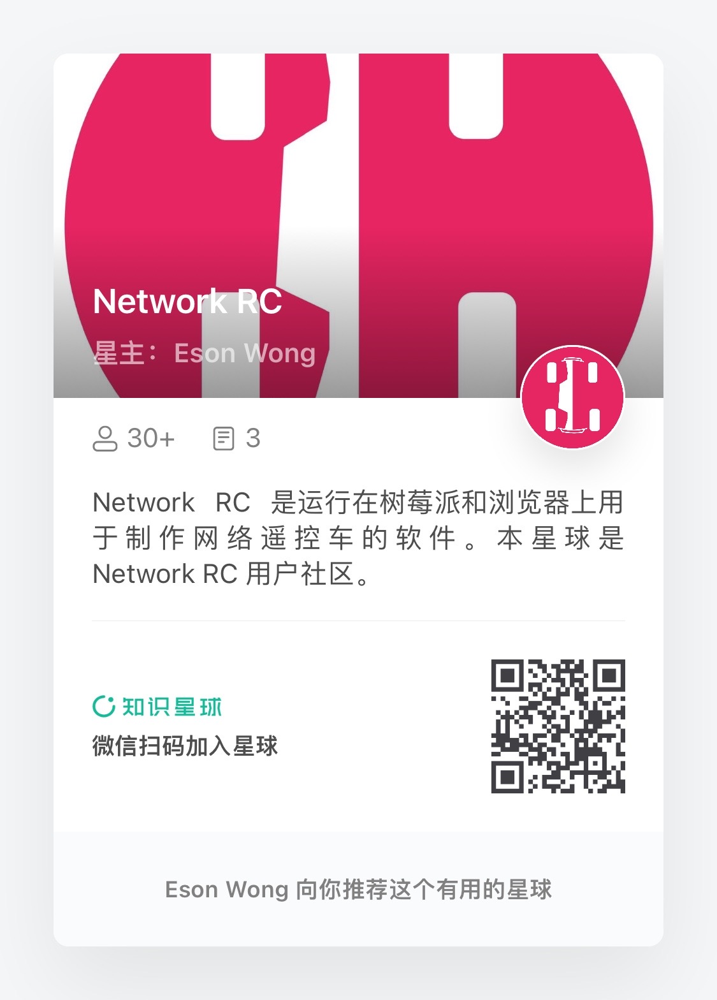
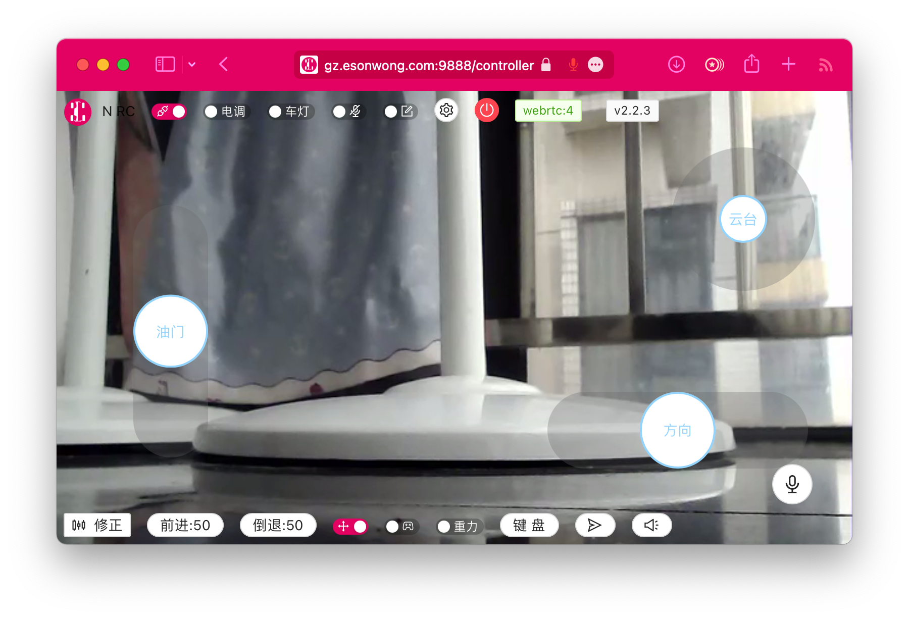

<iframe src="//player.bilibili.com/player.html?bvid=BV1p5411f7en&page=1&high_quality=1&as_wide=1" scrolling="no" border="0" frameborder="no" framespacing="0" allowfullscreen="true"  style="width: 100%; height: 640px;"> </iframe>

### 社区

### 微信群

### Discord

[Network RC Discord](https://discord.gg/mhHmHtmbZj)

<!--  -->
