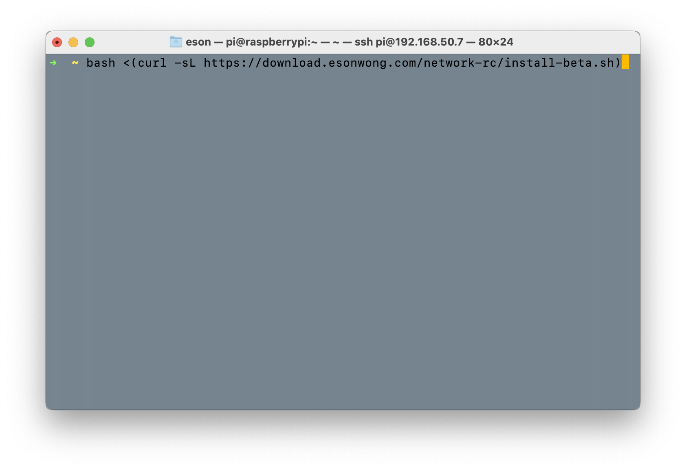
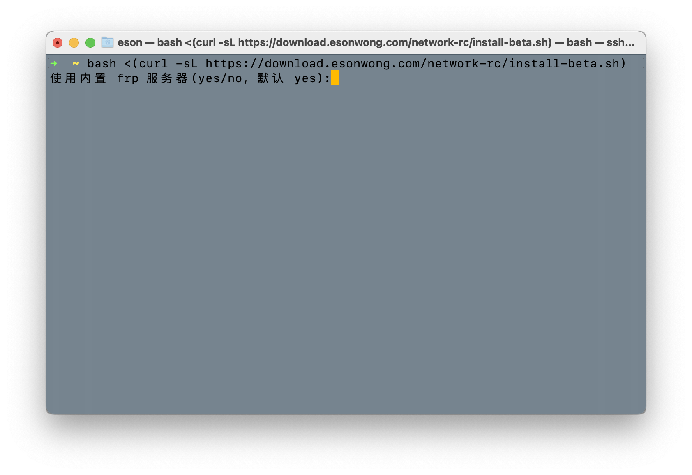
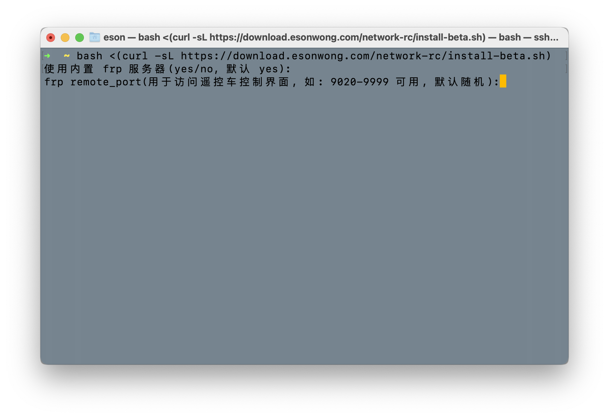
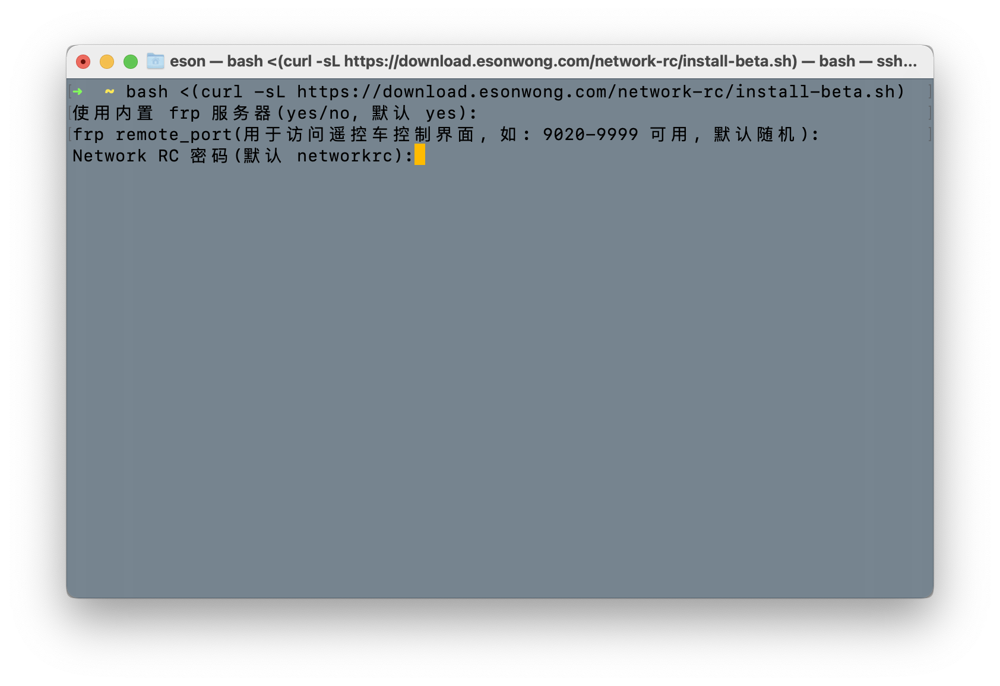
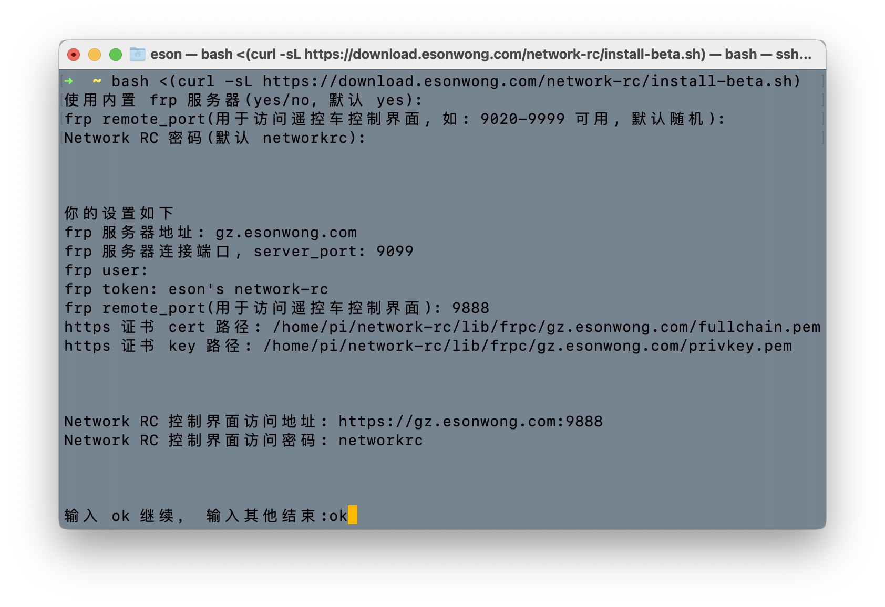
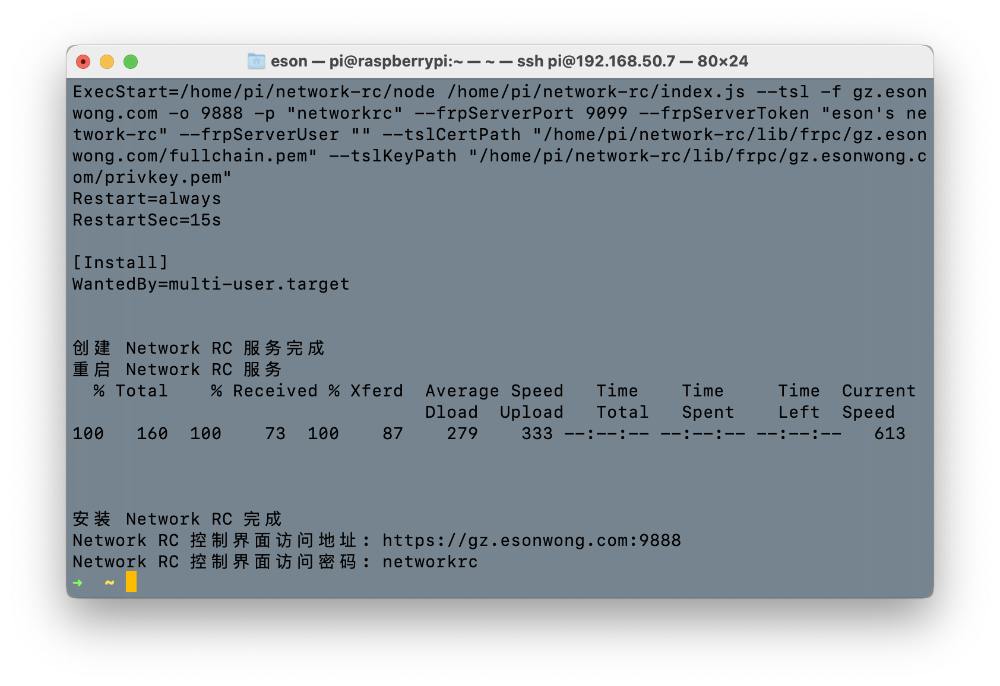
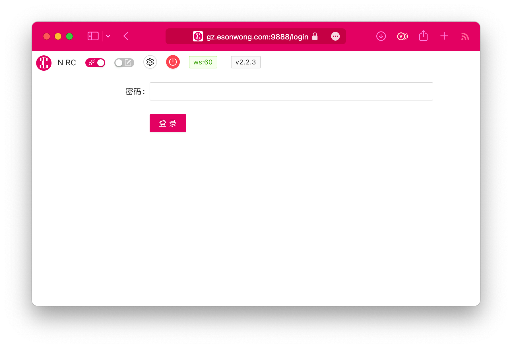
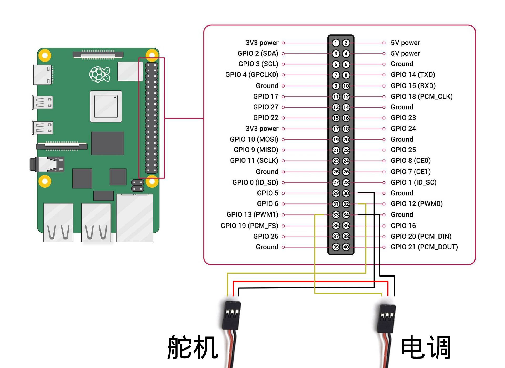
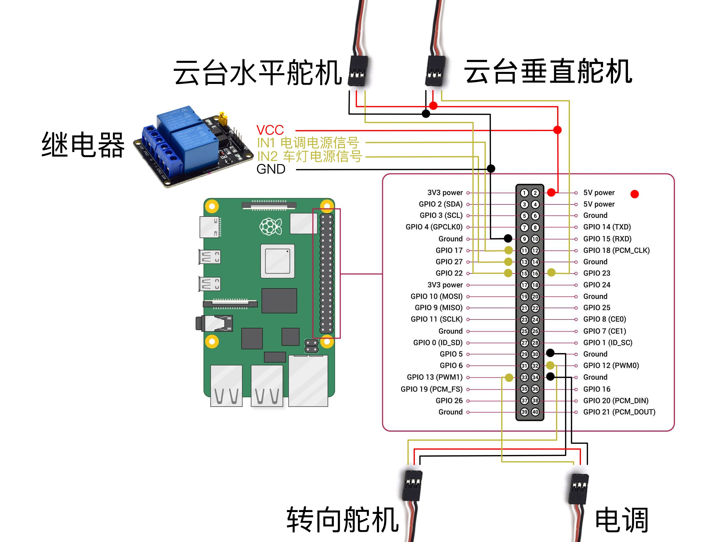

# 制作教程

## 树莓派上安装 Network RC

### 安装树莓派操作系统

根据这篇教程的“方法二”安装树莓派系统，并启用 SSH， 连接到 WiFi。

[树莓派 4B【RaspBerry Pi 4 Model B】系统安装及配置教程](http://article.docway.net/it/details/606bfa970a6c642cafe259fc)

> Network RC 仅支持 buster 系统。比如：[2021-12-02-raspios-buster-armhf.zip](https://downloads.raspberrypi.org/raspios_oldstable_armhf/images/raspios_oldstable_armhf-2021-12-02/2021-12-02-raspios-buster-armhf.zip)

### 打开摄像头

系统安装完成后使用 SSH 连接到树莓派命令行终端。如果连接显示器，则打开命令行终端。

1. 输入命令:

   ```bash
   sudo raspi-config
   ```

   

2. 选择 `Interface Options` 回车
3. 选择 `P1 Camera` 回车
4. 选择 `Yes`/`是`/`OK` 回车
5. 关闭树莓派电源
6. 连接树莓派 CSI 摄像头
7. 打开树莓派电源

### 安装 Network RC

使用一键安装脚本安装 Network RC 软件:

1. 在终端输入 Network RC 安装命令，回车执行：

   ```bash
   bash <(curl -sL https://download.esonwong.com/network-rc/install.sh)
   ```

   

2. 输入`yes`并回车，使用默认设置来安装

   

3. 回车，使用随机访问端口

   

4. 设置**登录密码**，回车确认

   

5. 输入`ok`并回车开始下载和安装 Network RC

   

6. 等待安装完成
   

安装完成后通过其他设备的浏览器即可打开**控制界面登陆地址**, 使用设置的**登录密码**登录。


登录后：


## 连接树莓派和舵机



树莓派关机断电。

关机命令： `sudo shutdown -h now`

> 以下下接线是按照 Network RC 的默认通道设置来连接的。

### 电调

1. 将舵机和电调的正极线(VCC\红色) 和 电调的正极线用公对公杜邦线连接起来，舵机从电调上取电。

   > ⚠️ 注意：舵机红色电源输出线不要直接连接树莓派，会导致树莓派烧毁。

1. 使用公对母杜邦线将电调的信号线(PWM\白色或黄色) 连接到树莓派的 GPIO 13 (编号 33\PWM1)
1. 使用公对母杜邦线将电调的地线(Ground\黑色或棕色) 连接到树莓派的 GPIO Ground，建议连接到编号 30 和 34，方便理线。

> 大部电调会在开机时对中位信号进行校准，请确保电调电源打开前 10 秒不要操作。

### 舵机

1. 使用公对母杜邦线将舵机的信号线(PWM\白色或黄色) 连接到树莓派的 GPIO 12 (编号 32\PWM0)
1. 使用公对母杜邦线将舵机的地线(Ground\黑色或棕色) 连接到树莓派的 GPIO Group，建议连接到编号 30 和 34，方便理线。

## 其他

我们现在完成了一个基本的具有远程遥控、网络图传的模型车。

### 4G/5G 网络连接

有两个方法可以让遥控车连接 4G/5G 网络。

一个是连接手机热点，把手机放到车里。

一个是在树莓派上查上 4G/5G 蜂窝网卡。

### 云台

摄像头可装在云台上增加视野。下面是默认设置的 2 轴云台的接线方法。



### 供电保障

为运行安全和稳定，树莓派必须保障稳定的 5V 3A 的供电。特别是使用 USB 蜂窝网卡的情况下。
